# 数据库原理

# 	目录	

[TOC]

## 第一章 数据库概念

### 第一节 数据库基本概念

> 1. 数据是描述事物的符号记录，指**物理符号记录下来的,可鉴别的信息**
> 2. 数据库是长期存储在计算机内，有组织,可共享的大量数据集合，数据库数据具有**永久存储,、有组织和可共享的特点**
> 3. **数据库管理(简称DBMS)**位于用户与操作系统之间的数据管理工具
>    1. 数据定义功能，提供数据定义语言(DDL)
>    2. 数据操作功能，提供数据操作语言(DML)
>    3. 数据库的运行管理，通过数据的安全性，完整性，多用户对数据并发操作及故障的系统恢复
>    4. 数据库建立和维护
>    5. 数据组织，存储和管理功能
> 4. 数据库系统是数据库技术后的系统，包括**数据库，数据库管理系统及相关实用工具，应用程序，数据库管理员和用户**。**数据库管理员(DBA)**负责数据库维护

### 第二节 数据库管理技术的发展

> 1. 人工管理
>    1. 数据**不保存**
>    2. 应用程序**管理**数据
>    3. 数据**面向**应用
>    4. **记录内无结构，整体五结构**
> 2. 文件系统阶段
>    1. 数据的管理者 数据**长期保存**
>    2. 数据面向的对象 某一应用程序
>    3. 数据的共享程度 **共享性差，数据冗余度大**
>    4. 数据的结构性 **独立性差**，数据的逻辑结构改变必须修改应用程序
>    5. 数据控制能力 应用程序自己控制
> 3. 数据库系统阶段
>    1. **数据集成**
>    2. **数据共享性高**
>    3. **数据冗余小**
>    4. **数据一致性**
>    5. **数据独立性高**
>    6. **实施统一管理和控制**
>    7. 减少应用程序开发与维护

### 第三节 数据库结构

> 1. 模式称之为**概念模式或逻辑模式**，是全体数据的**逻辑结构和特征描述**，是所有用户的**公共数据视图**
> 2. 外模式称之为**子模式(Subschema)或用户模式**，是数据库用户可以**看到和使用的局部数据的逻辑结构和特征描述**，**DBMS**提供了子模式的描述语言(Subschema DDL)
> 3. 内模式称之为**存储模式(Storage Schema)**，是数据库中**数据物理结构和存储方式的描述**，是数据在**数据库内部的表示形式**
> 4. **三级模式结构**的**两层映像**与**数据独立性**
>    1. **外模式/模式映像(逻辑独立性)**
>    2. **模式/内模式映像(物理独立性)**
> 5. **客户/服务器(Client/Server,C/S)模式**
> 6. **浏览器/服务器(Browser/Server,B/S)模式**

### 第四节 数据模型

> 1. 数据结构描述的是**系统的静态特性**，及数据对象的数据类型，内容，属性及数据对对象之间 的联系
> 2. 数据操作描述的是**系统的动态特性**，是对各种对象的实例允许执行的**操作集合**，包括**操作及有关操作规则**
> 3. 数据约束条件描述的是**数据结构中数据间的语法和语义关联**，包括**相互制约与依存关系以及数据动态变化规则**，以保证数据的**正确性，有效性与相容性**
> 4. 数据模型分类
>    - 概念层数数据模型
>      1. **实体(Entity)** 指的是**客观存在并可相互区别的事物**称之为实体，可以是具体的人，事，物或抽象的概念。
>      2. **属性(Attribute)**指的是**实体所具有的某一特性称为属性**，一个实体是由若干属性刻画
>      3. **码(key)**指的是**唯一标识实体的属性集**称之为码
>      4. **域(Domain)**指的是**属性的取值范围**称之为属性的域
>      5. **实体型(Entity Type)**指的是**实体名及其属性名集合去抽象和刻画**，同类实体称为实体型
>      6. **实体集(Entity Set)**指的是**同型的实体集合称之为实体集**
>      7. **联系(Relationship)**指的是**实体内部的联系和实体之间的联系**
>         - 实体类型联系
>           - **一对多** 1:N
>           - **一对一** 1:1
>           - **多对多** N:M
>    - 概念模型的表示方法
>      1. 概率模型用于描述现实世界的事物,与具体的设计系统无关，最典型的概念模型是**实体联系(E-R)**
>         - 
> 5. 逻辑层数据模型
>    1. 层次模型
>    2. 网状模型
>    3. **关系模型**
>    4. 面向对象模型
> 6. 物理层数据模型，称之为**数据的物理模型(Physical Model)**,其描述的是数据在**存储介质上的组织结构**，是逻辑层的**物理实现**，即每一种**逻辑模型在实现时都有与其对应的物理模型**
> 7. **概念-》逻辑-》物理 == 外模式-》模式-》内模式**

### 本章小节

## 第二章 关系数据库

### 第一节 关系型数据库概述

> 1. 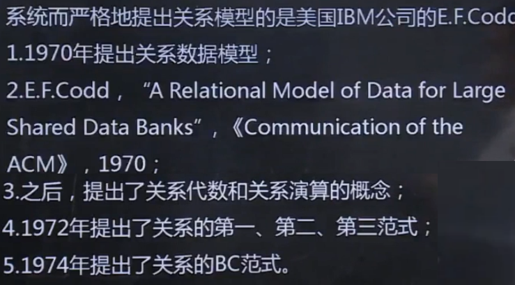
> 2. 关系数据库应用**数学方法**来处理数据库数据
> 3. 常见的实验系统和商用系统
>    - 实验系统：System R，Universal INGRES
>    - 商用系统：ORACLE，IBM DB2，INFORMIX，SYBASE

### 第二节 关系数据模型

> 1. 关系模型的数据结构只包含**单一的数据结构,即关系**
>
> 2. 基本术语
>
>    1. **表(Table)**称之为**关系**,是一个二维的数据结构,是由**表名(关系)**构成的表的各个**列(属性)**及若干行数据组成，每张表都**有且只有一个唯一表名**，表中每一行数据描述一条具体的记录。
>    2. **关系(Relation)**，一个**关系逻辑对应一张二维表**,可为**每个关系取一个名称进行标识**
>    3. **列(Column)**称之为**字段(Field)**或**属性(Attribute)**，每列都有一个名称，称之为**列名，字段名，属性**，每列表示**实体的一个属性且具有相同的数据类型**
>    4. **属性(Attribute)**即一列为一个属性，给每个属性起名称即为属性名,**与之同义的术语是“列”**，**属性的个数称之为关系的元或度**，列的值为属性值；**属性值的取值范围称之为值域**
>    5. **行(Row)**称之为**元组(Tuple)**或**记录(Record)**
>    6. **元组(Tuple)**即为表中的一行
>    7. **分量(Component)**,元组中的一个属性值称之为分量
>    8. **码或键(Key)**,如果在一个关系中存在使得**该关系的任何一个关系状态中的两个元组,在该属性(或属性组)上值的组合不同**，即这些**属性(或属性组)的值都能用来标识该关系的元组**，则此属性(或属性组)称之为**该关系的码和键**
>    9. **超码或超键(Super Key)**，在**关系的一个码或键中移除某个属性，仍然是这个关系的码**，则这种码或键称之为超码或超键
>    10. **候选码或候选键(Candidate Key)**，在**关系的一个码或键中不能移除某个属性，否则他不再是这个关系的码或键**，则这种码称之为候选码或候选键
>    11. **主键或主码(Primary Key)**,在**一个关系的若干候选码或候选键中指定一个作为关系的唯一标识的元组**(在设计表时尽量保证一表一主键)
>    12. **全码或全键(All-Key)指的是关系模式中所有属性集合是该关系的主键或主码**
>    13. **主属性(Prime Attribute)和非主属性(Nonprime Attribute)**,关系中**包含在任意一个候选码中的属性**称之为主属性或码属性,**不包含在任何一个候选码中的属性**称之为非主属性或非码属性
>    14. **外码或外键**，当关系中某一属性(或属性组)**不是该关系的主码或候选码,而是另一关系的主码。**
>    15. **参照关系(Referencing Relation)和被参照关系(Referenced Relation)**,参照关系称之为从关系，被参照关系称之为主关系，指的是以外码相关联的两个关系。**以外码作为在主码的关系称之为被参照关系；外码所在的关系称之为参照关系。通过外码相联系，一般为一对多的联系；**
>    16. **域(Domain)**,属性的取值范围
>    17. **数据类型(Data Type)**,表中每列都有其相应的数据类型,它用于限制或容许该列的存储数据。每个字段表示同一类信息，具有相同的数据类型
>    18. **关系模型(Relation Schema)**,数据库有**型(type)和值(value)**之分，在关系型数据库中，**关系模式是型，关系是值**，即**关系模式对关系的描述**。关系模式是**静态的，稳定的**，而关系是**动态的，随时间不断变化的**
>    19. **关系数据库(Relation Database)**是以**关系模型作为数据的逻辑模型,**并**采用关系作为数据的组织方式**，其**操作是建立在关系代数的基础上**的
>
> 3. 关系操作
>
>    - 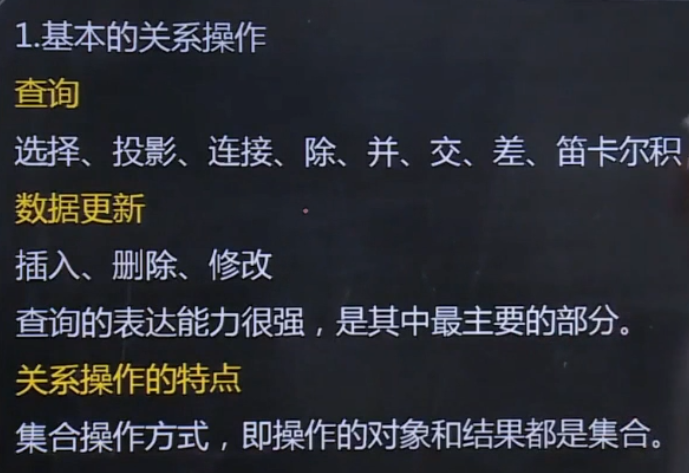
>
> 4. 关系数据语言的分类
>
>    - 关系操作能力分为**代数方式**和**逻辑方式**
>    - 代数方式主要有**关系代数** ，通过对关系的操作来表达查询要求
>    - 逻辑方式主要有**关系演算** ，通过使用谓词来表达查询要求的方式
>    - 具有**关系代数和关系演算**的双重特点的语言 
>    - 典型代表SQL
>
> 5. 关系代数
>
>    
>
>    - 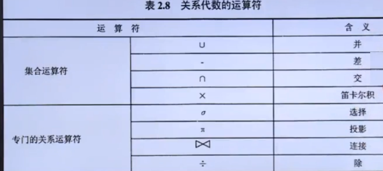
>
>    - 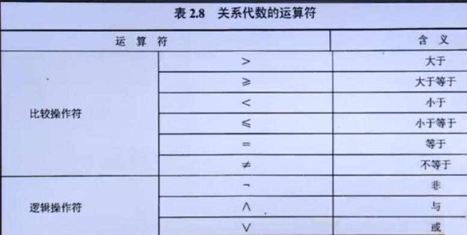
>
>      
>
> 6. 专门关系运算
>
>    1. 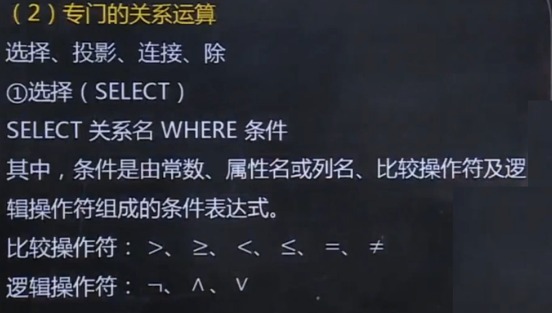
>    2. 
>    3. 
>    4. 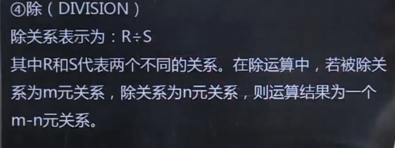
>    5. 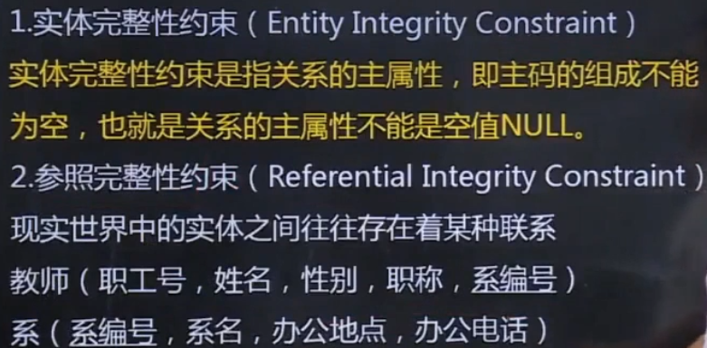
>    6. 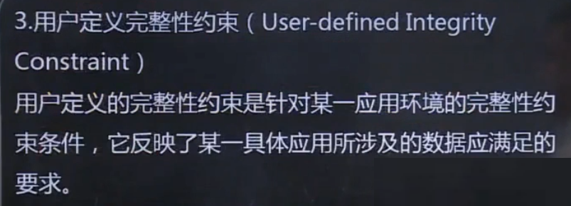
>    7. 关系模型完整性约束检验
>       1. 执行插入
>       2. 执行删除
>       3. 执行更新

### 第三节 关系型数据库规范化理论

> 1. 关系型数据库存在冗余和异常的问题
>    - 数据冗余
>    - 更新异常
>    - 插入异常
>    - 删除异常
> 2. 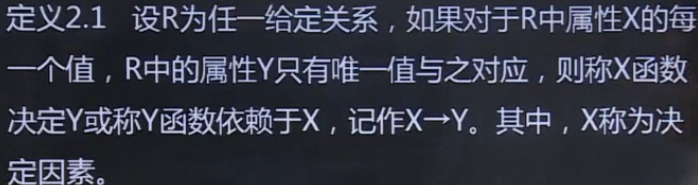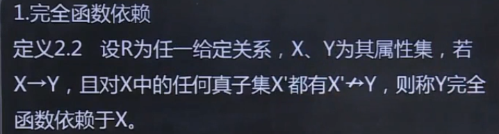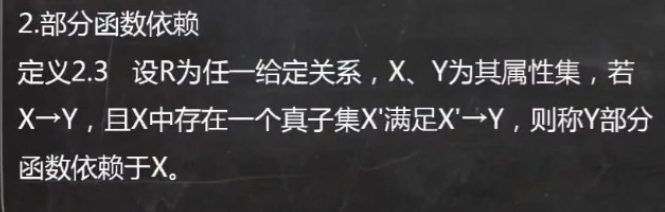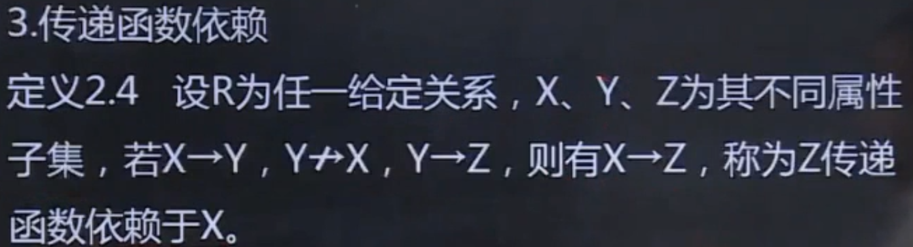
> 3. 关键字 
>    - 设R为任一给定关系,U为其所含的全部属性集合，X为U的子集，若有完全函数依赖X->U,则X为R的一个候选关键字
> 4. 范式
>    - 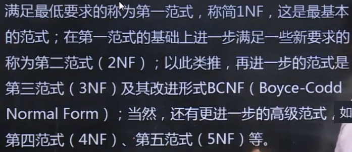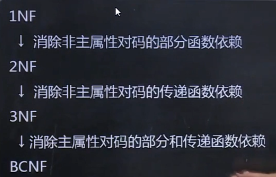
> 5. 

###  本章小节

## 第三章 数据库设计

### 第一节 数据库设计概述

> 1. 数据库生命周期分为**数据库分析与设计阶段,数据库实现与操作阶段**
> 2. 数据库分析与设计阶段包括**需求分析,概念设计，逻辑设计和物理设计**，数据库实现与操作阶段包括**数据库实现，操作与监督，修改与调整**
> 3. 数据库设计的两个目标，即**满足应用功能需求和良好的数据库性能**
> 4. 数据库设计从用户对数据需求出发，主要包含**数据库结构设计和数据库行为设计**
> 5. 数据库设计方法
>    1. 直观设计法
>    2. 规范设计法
>       - 新奥尔良(New Orleans)设计方法
>       - 基于E-R模型的数据库设计方法
>       - 基于第三范式的设计方法
>    3. 计算机辅助设计法
> 6. 数据库设计过程
>    - 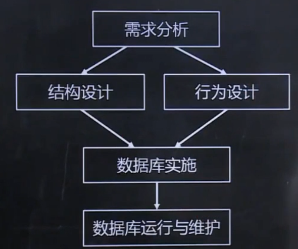

### 第二节 数据库设计基本步骤

> 1. 需求分析
>    1. **确定数据库范围**，即确定数据库**支持哪些应用功能**(费时费钱)；
>    2. **应用过程分析**，指**分析数据与数据处理间的关系**，数据库范围确立后，应**逐次了解和分析每个部门或功能需要的数据，数据使用的顺序，对数据作何处理和处理策略及处理结果**
>    3. 收集和分析数据 
>       1. **静态结构**指**不施加应用操作于数据的原始状态**，通过**数据分类表和数据元素**进行说明
>       2. **动态结构**指将**应用操作施加于数据上后的数据状态**，可通过**任务分类表和数据操作特征表**进行说明
>       3. **数据约束**指使用数据时的特殊要求
>    4. 编写需求报告
>       1. **数据库应用功能目标**
>       2. **标明**不同**用户视图范围**
>       3. **应用处理**过程**需求说明**
>       4. **数据字典**
>       5. **数据量**
>       6. **数据约束**
> 2. 概念结构设计
>    1. 在需求分析中产生的**需求报告的基础上按特定的方法设计的应用需求的用户信息结构**
>    2. 消息结构通常称之为概念模型，常采用**E-R图作概念模型的描述工具**
> 3. 逻辑结构设计
>    1. 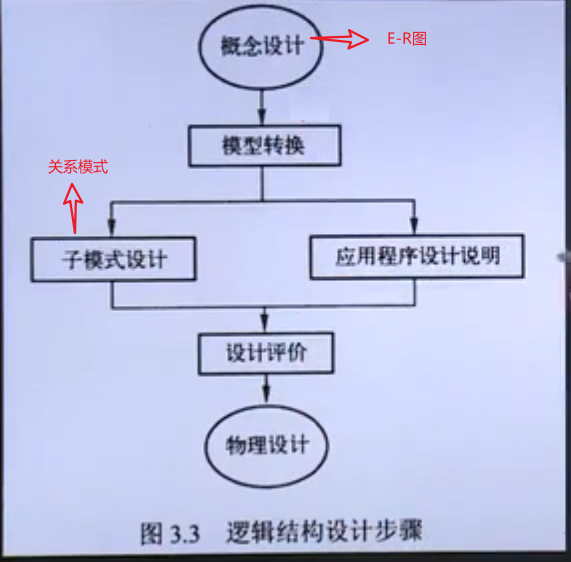
> 4. 物理设计
>    1. 指的是**对于一个给定的数据逻辑结构,研究并构造物理结构的过程**，具体任务是**确定数据库存储设备上的存储结构和存取方法**,因**DBMS的不同**还可能包括**建立索引和聚集，及物理块大小,缓冲区个数和大小,数据压缩的选择等**
> 5. 数据库实施
>    1. 加载数据
>    2. 应用程序设计
>    3. 数据库试运行
> 6. 数据库运行和维护
>    - 经过运行后，**确认系统无故障或暂未发现故障**后**投入实际生产中**运行,**标志着数据库设计和应用开发的基本完成，但不意味着设计和应用开发工作的终止**，系统维护中最困难是**数据库重组和重构**

### 第三节 关系数据库设计方法

> 1. 关系数据库设计过程与各级模式
>    - 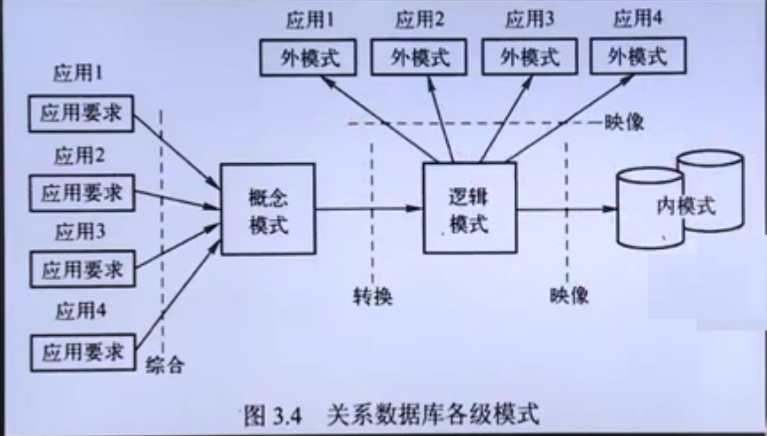
> 2. 概念结构设计方法
>    - 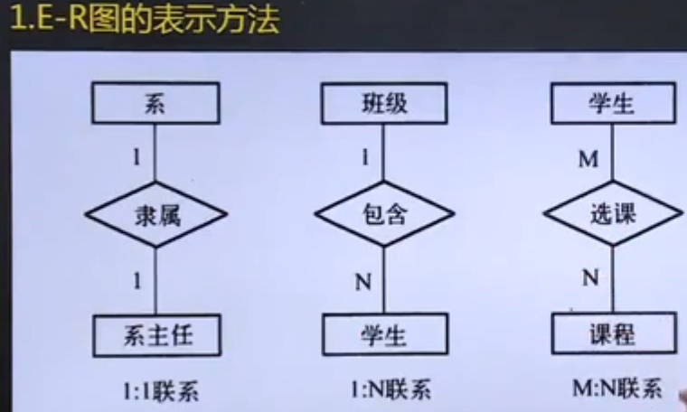
>    - 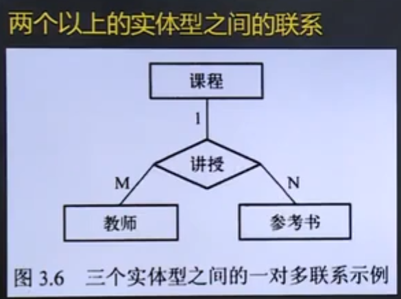
>    - 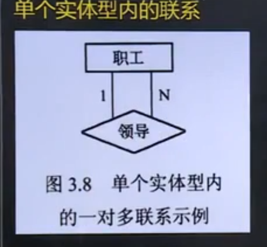
> 3. 局部信息结构设计
>    1. 确定局部范围
>    2. 选择实体
>    3. 选择实体的关键字属性
>    4. 确定实体间联系
>    5. 确定实体的属性
> 4. 全局信息结构设计
>    1. 属性冲突
>    2. 命名冲突
>    3. 结构冲突
> 5. 逻辑结构设计方法
>    1. E-R图向关系模型的转换
>    2. 数据模型的优化
>    3. 设计用户模式
> 6. 物理设计方法
>    1. 建立索引
>    2. 建立聚集

### 本章小节

## 第四章 SQL与关系数据库基本操作

### 第一节 SQL概述

> 1. SQL发展
>
>    - **结构化查询语言(Structured Query Language，简称SQL)**是**介于关系代数和关系演算之间的语言**，SQL最终成为了**关系数据库的标准语言和数据库领域中的主流语言**，也被ANSI认证为了**数据库系统的工业标准**，此外**SQL语言不分大小写**
>
> 2. SQL的特点
>
>    1. SQL不是某个特定数据库供应商的专属语言
>    2. SQL简单易学据有**很强的描述性**，使用的英文单词不多
>    3. SQL看起来简单但是**可以进行非常复杂和高级的数据库操作**
>
> 3. SQL组成
>
>    1. **数据定义语言**(Data Definition Language，DDL)
>
>    2. **数据操纵语言**(Data Manipulation Language，DML)
>
>    3. **数据控制语言**(Data Control Language，DCL)
>
>    4. 嵌入式和动态SQL规则
>
>    5. SQL调用和会话规则
>
>       

### 第二节 MySQL预备知识

> 1. MySQL使用基础
>    1. **LAMP(Linux+Apache+MySQL+PHP/Perl/python)**
>    2. **WAMP(Windows+Apache+MySQL+PHP/Perl/python)**
> 2. MySQL中的SQL
>    1. 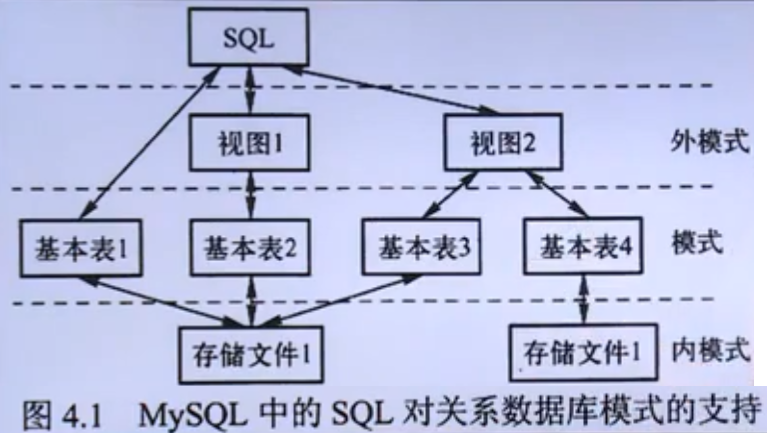
>    2. SQL术语
>       1. **常量**指的是**单引号或双引号括起来的字符序列**，分为**ASCII字符串常量(一个字节)****和**Unicode字符常量(两个字节)**，Unicode字符常量与ASCII字符常量相似，**但需在其前面加N标志符**
>          1. **数值常量**可分为**整数常量**和**浮点数常量**，**整数常量即不带小数点的十进制数**，**浮点数常量即使用小数点的数值常量**
>          2. **十六进制常量**，MySQL**支持十六进制常量**，每对十六进制数字被转换为一个字符，其中**最前面有一个大写字母X或小写字母x，其前缀可以使用0x(x小写)代替且不使用引号**,在引号中只能使用**数字0-9及字母a-f或大写字符A-F**，x'4D7953514C表示字符串MySQL，不区分大小写，十六进制**默认类型为字符串**，如果要**作数值处理可使用CAST(... AS UNSIGNED)**
>          3. **日期时间常量**，用**单引号将表示日期时间的字符串括起构成**，**日期型常量**包括年月日，数据类型为**Date**，**时间型常量**包括小时数，分钟数，秒数及微秒数，数据类型为**TIME**
>          4. **位字段值**使用**b'value'**符号写位字段值
>          5. **布尔值**只包含**TRUE和FALSE**，FALSE的数字值为**1**，TRUE的数字值为**0**
>          6. **NULL**可适用于各种列类型，通常表示**无数据，没有值**等意义，**不等同于**数字类型的0或字符串类型的空字符串
>       2. **变量**，用户可以自定义的变量叫做**用户变量**，使用用户变量前**必须初始化和定义**，如果使用没有初始化的变量，值则为**NULL**，用户变量前需**加@来区分列名**，系统变量前需**加2个@**
>       3. 运算符
>          1. **算术运算符**在两个表达式上执行数字运算，表达式可以是**任意数字数据类型**，算术运算符有**+(加)，-(减)，*(乘)，/(除)和%(取模)**
>          2. **位运算符**有&(位与)，|(位或)，^(位异或)，~(位取反)，>>(位右移)，<<(位左移)
>          3. **比较运算符**，用于比较两个表达式的值，其**运算结果为逻辑值**，可为以下三种其一，**1(真)，0(假)，Null(不能确定)**
>             - 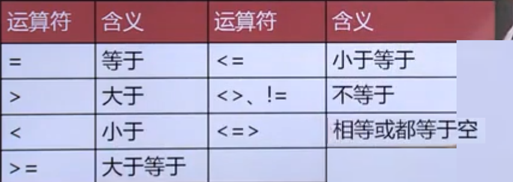
>          4. **逻辑运算符**
>             - 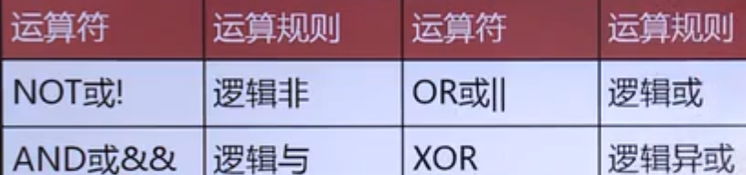
>          5. **表达式**是常量，变量，列名，复杂计算，运算符和函数的组合，表达式的值通常是某种数据类型，根据表达式的值类型，可以分为**字符型表达式，数值型表达式和日期表达式**
>          6. **内置函数**
>             1. **数学函数**，如ABS()函数(绝对值)，SORT()函数(开根号)
>             2. **聚合函数**，例如COUNT()函数(数字的行列)
>             3. **字符串函数**，例如ASCII()函数(取字符的ASCII值)，CHAR()函数(ASCII值转字符)
>             4. **日期和时间函数**，例如NOW()函数(当前时间)，YEAR()函数
>             5. **加密函数**，例如ENCODE()函数，ENCRYPT()函数
>             6. **控制流程函数**，例如IF()函数，IFNULL()函数
>             7. **格式化函数**,例如FORMAT()函数
>             8. **类型转换函数**，例如CAST()函数
>             9. **系统信息函数**，例如USER()函数(当前用户信息)，VERSION()函数(当前mysql版本)

### 第三节  数据定义({}是必选，[]是可选 ) 

> 1. 数据库的增删改
>    
>    1. 创建(CREATE )数据库 
>       - 语法格式 ：**CREATE {DATABASE|SCHEMA} [IF NOT EXISTS] db_name [DEFAULT] CHARACTER SET charset_name | [DEFAULT] COLLATE collation_name**
>         1. db_name **数据库名**
>         2. ,charset_name **字符集名称**
>         3. IF NOT EXISTS 在建数据库前进行判断,只有**数据库目前不存在时才执行CREATE DATABASE操作**
>         4. DEFAULT **指定默认值**
>         5. CHARACTER SET **指定数据库字符集(Charset)**
>      6. COLLATE 指定字符集校对规则
>         7. collation_name 校对规则名称
>    2. 选择数据库
>    
>       - 语法格式 ：USE db_name;
>    3. 修改(ALTER )数据库 
>       - 语法格式 ：**ALTER {DATABASE |SCHEMA} [db_name] alter_specification [,alter_specification]...**
>         1. alter_specification : **[DEFAULT] CHARACTER SET charset_name | [DEFAULT] COLLATE collation_name**
>    4. 删除(DROP)数据库
>       - 语法 ：**DROP DATABASE [IF EXISTS] db_name**
>         1. db_name 是需要删除的数据库名称，**可使用IF EXISTS子句以避免删除不存在的数据库而出现的MySQL错误信息**
>    
> 2. 查看(SHOW )数据库
>
>    - 语法：**SHOW [DATABASES |SCHEMAS]**
>
> 3. 表定义
>
>    1. 数据类型
>
>       1. 数值类型
>          - **整数类型** INT
>          - **浮点类型** FLOAT DOUBLE DECIMAL
>       2. 日期和时间类型
>          - **日期类型** DATE(YYYY-MM-DD) YEAR
>          - **日期时间类型** DATETIME TIME
>          - **时间戳类型** TIMESTAMP
>       3. 字符串类型
>          - **固定长度类型** CHAR 最大长度255
>          - **可变长度类型** VARCHAR 最大长度65535
>          - **文本类型** TEXT
>
>    2. 表的增删改
>
>       1. 创建表
>
>          - 语法格式：**CREATE TABLE [IF NOT EXISTS] tb_name(字段名 1 数据类型 [列级完整性约束条件] [默认值] [，字段名 2 数据类型 [列级完整性约束条件] [默认值] ] [,.....] [表级完整性约束])[ENGINE = 引擎类型]**
>
>       2. 添加字段
>
>          - 语法格式：**ALTER TABLE tb_name ADD [COLUMN] 新字段名  数据类型[约束条件] [FIRST | AFTER 已有字段名]**
>
>       3. 修改字段
>
>          - 语法格式：
>
>            [1]**ALTER TABLE tb_name CHANGE [COLUMN] 原字段 新字段 数据类型 [约束条件]  **
>
>            [2]**ALTER TABLE tb_name ALTER[COLUMN] 字段名 {SET | DROP} DEFULT** 
>            
>            [3]**ALTER TABLE tb_name MODIFY [COLUMN] 字段名 数据类型[约束条件] [FIRST | AFTER] 已有字段名**　
>
>       4. 删除字段
>
>          - 语法格式：**ALTER TABLE tb_name DROP [COLUMN] 字段名**
>
>       5. 重命名表
>
>          - 语法格式：**ALTER TABLE 原表名 RENAME [TO] 新表名 **
>
>            **RENAME TABLE 原表名1 TO 新表名 [,原表名2 TO 新表名2] .....**
>
>       6. 删除表
>
>          - 语法格式：**ALTER TABLE DROP TABLE [IF EXISTS] 表1 [,表2]....... **
>
>       7. 查看表
>
>          - 语法格式：**SHOW TABLES [{FROM|IN} db_name] **
>
>       8. 查看表结构
>
>          - 语法格式：**SHOW COLUMNS {FROM|IN} tb_name[{FROM|IN} db_name]**
>
>    3. 索引(排序)定义
>
>       1. 可理解为**目录**，**在查找时目录可以加快查找**
>
>       2. 索引分类
>
>          1. 用途类
>             - **普通索引** (INDEX)
>             - **唯一性索引** (UNIQUE)
>             - **主键** (PEIMARY KEY)
>             - **全文索引** (FULLTEXT)[引擎MYISAM]
>             - **聚簇索引** [引擎InnoDB]
>          2. 列级索引
>             - **单列索引**
>             - **组合索引**
>
>       3. 索引的增删改
>
>          1. 索引的语法
>
>             - 语法格式：
>
>               [1]**CREATE TABLE tbl_name[col_name data_typer] [CONSTRAINT index_name] [UNIQUE] [INDEX | KEY] [index_name] (index_col_name[length])[ASC | DESC]**
>
>               [2(常用)]**CREATE [UNIQUE] INDEX index_name ON tbl_name(col_name[(length)] [ASC|DESC],....)**
>
>               [3]**ALTER TABLE tbl_name ADD[UNIQUE|DULLTEXT] [INDEX|KEY] [index_name] (col_name[length] [ACS | DESC])** 
>
>          2. 索引的查看
>
>             - 语法格式： **SHOW {INDEX|INDEXS|KEYS} {FROM|IN} tbl_name [{FROM|IN} db_name]**
>
>          3. 索引的删除
>
>             1. 语法格式：
>
>                ​	(1) **DTOP INDEX index_name ON tbl_name **
>
>                ​	(2)**ALTER TABLE tbl_name DROP INDEX index_name**
>

### 第四节 数据更新

> 1. 数据增删改
>
>    1. 插入数据
>
>       - 数据格式
>
>         [1(常用)]**INSERT INTO tbl_name(column_list) VALUES (value_list1)[,(value_list)]...**
>
>         [2(复制数据)]**INSERT INTO tbl_name1(column_list1) SELECT(column_list2) FROM tbl_name2 WHERE(condition)**
>
>         **注：column_list1与column_list2必须个数相同且数据一一对应**
>
>         [3]**使用INSERT...SET语句插入部分列值数据**
>
>         **INSERT [INTO] tbl_name SET col_name = {expr | DEFAULT},* * *  **
>
>         [4]**使用INSERT..SELECT语句插入子查询**
>
>         **INSERT[INTO]TBL_NAME[(COL NAME,**-)] SELECT**
>
>    2. 删除数据
>
>       - 数据格式 ：**DELETE FROM tbl_nam[WHERE< condition >];** 
>
>    3. 删除记录
>
>       - 数据格式：**TRUNCATE[TABLE] tbl_name**
>         - **注：TRUNCATE是删除整个表,重新建表，在删除全部数据时效率高于DELETE,DELETE是逐条删，TRUNCATE无法恢复，AUTO_INCREMENT计数器重置**
>
>    4. 修改数据
>
>       - 数据格式：**UPDATE tbl_name SET col_name1 =expr1[,col_name2=expr2...] [WHERE where_defintion]**
>
> 

### 第五节 数据查询

> 1. 数据的查
>
>    1. SELECT 语句
>
>       - 基本语法：
>
>          **SELECT [ALL | DISTINCT | DISTINCTROW] select_expr,... [FROM table_reference[,table_reference] [WHERE where_defintion]] [GROUP BY{col_name | expr | position} [ASC | DESC],....[WITH ROLLUP]] [HAVING where_defintion (使用聚合函数时使用)] [ORDER BY{col_name | expr | position} [ASC|DESC],...] [LIMIT {[offset,] row_count | row_count OFFSET offset}]**
>
>          | 子句     | 说明               | 是否必须使用               |
>          | -------- | ------------------ | -------------------------- |
>          | SELECT   | 要返回的列或表达式 | 是                         |
>          | FROM     | 从中检索数据表     | 仅在从表中选择数据时使用   |
>          | WHERE    | 行级过滤           | 否                         |
>          | GROUP BY | 分组说明           | 仅在按组计算聚合函数时使用 |
>          | HAVING   | 组级过滤           | 否                         |
>       | ORDER BY | 输出排序顺序       | 否                         |
>          | LIMIT    | 要检索的行数       | 否                         |
>
>    2. 列的选择与指定
>
>       1. 选择指定的列
>          - 基本语法：**SELECT column_list,column_list,column_list .. FROM tbl_name**
>       2. 定义并使用别名
>          - 基本语法：**SELECT  column_list as 别称,column_list as 别称 from tbl_name**
>       3. 替换查询结果集中的数据(MySQL 特有，不一定都支持)
>          - 基本语法：**CASE WHEN 条件1 then 表达式1 WHEN 条件2 THEN 表达式2 .... ELSE 表达式 END[AS] column_alias**
>       4. 计算列值
>          - 使用select语句进行列查询时，在**结果集中可对列值进行计算**，其具体使用的方法是 **将SELECT语句的语法项 select**
>    5. 聚合函数
>       
> - 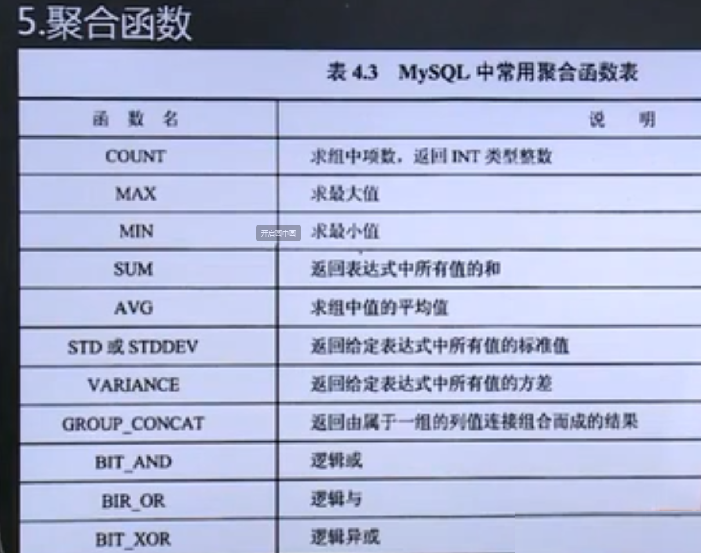
>          
> 3. FROM子句与多表连接查询
>    
>       1. **交叉连接**
>       2. **内连接** FROM table1 [INNER] JOIN table2 ON 连接条件
>       3. **等值连接** FROM table1,[table2] ..... WHERE table1.字段 <比较运算符> table2.字段
>       4. **外连接**
>          1. **左连接** FROM table1 [LEFT] JOIN table2 ON 连接条件 
>       2. **右连接** FROM table1 [RIGHT] JOIN table2 ON 连接条件
>    
> 4. WHERE子句与条件查询
>    
>       1. 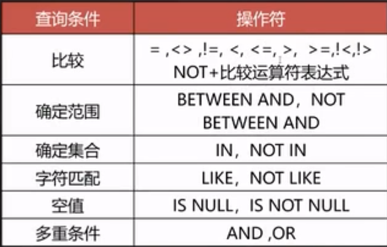
>       2. 子查询
>          - 基本语法 **WHERE 列名 IN (值列表或子SELECT[但必须只有一列])**
>       3. 比较运算符
>          - 基本语法 **WHERE 列名 <比较运算符>(值或子SELECT[但必须只有一个值])**
>    4. EXIST查询
>       
>    - 基本语法 **WHERE EXIST(子SELECT)**
>      
>    5. GROUP BY子句
>    
> - 基本语法 **[GROUP BY 字段列表] [HAVING<条件表达式>]**
>       - 含义： **按照某一列的值相同的分一组，进行聚合运算，**
>
>    6. HAVING子句
>
>       - **在使用SELECT语句中可使用HAVING子句进行过虑分组，即在集中规定包含哪些分组和排除哪些分组**
>
>    7. ORDER BY子句
>
>       - 基本语法 **[ORDER BY 字段1 [ASC(升序) | DESC(降序)] [,字段2[ASC | DECS]]].....**
>
>    8. LIMIT子句
>   
>       - 基本语法 **LIMIT[位置偏移量，]行数**

### 第六节 视图

> 1. 或视图视图是**一个或多个表(或视图)导出的表**，是**数据库的用户使用数据库的观点**，是一张**虚表**，视图一旦定义就可以**像表一样被查询，删除，更新和修改**
> 2. 视图的增删改
>    1. 创建视图
>       - 基本语法 **CREATE [OR REPLACE] [ALGORITHM = {YNDEFINED | MERGE | TEMPTABLE}] VIEW view_name[{column_list}] AS select_statement [WITE [CASCADED | LOCAL]CHECK OPTION] WHERE  tbl_name**
>    2. 删除视图
>       - 基本语法 **DROP VIEW [IF EXISTS] view_name[,view name]...**
>    3. 修改视图
>       - 语法格式 **ALTER VIEW view_name [(column_list)] AS select_statement [WITH[CASCADED | LOCAL ] CHECK OPTION]**
>    4. 查看视图
>       - 语法格式 **SHOW CREATE VIEW view_name**
>    5. 更新视图
>       - 通过视图更新基本表数据，**必须保证视图**是可更新视图，即**可在INSERT,UPDATE或DELETE等语句中使用，**对于可更新视图，在**视图中的行与基表中的行必须具有一一对应更新**,还有一些**特定的其他结构**，这类结构会使**视图不可更新**(建议：尽量不在视图中进行增删改操作，直接在基表进行增删改操作)
>    6.  查看视图数据
>       - 视图一旦定义就可像数据库中的真实表一样，进行数据的查询检索，也是对视图使用最多的操作

### 本章小结

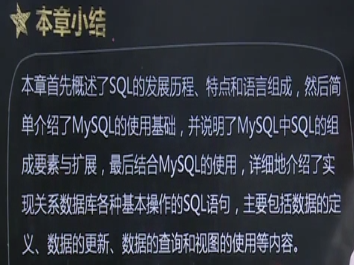

## 第五章 数据库编程

### 第一节 存储过程

> 1. **存储过程**是**一组为了完成某项特定功能的SQL语句集，本质是存储在数据库中的代码**，可由 **声明式SQL语句(如CREATE,UPDATE和SELECT等语句)**和 **过程式SQL语句(如IF...THEW...ELSE控制结构语句)**
>
> 2. 存储过程的优点
>
>    1. **提高运行速度**
>    2. **增强SQL的功能和灵活性**
>    3. **降低网络的通信量**
>    4. **减轻程序编写的工作量**
>    5. **间接实现安全控制功能**
>
> 3. 存储过程的创建与修改
>
>    1. 创建存储过程
>
>       - 语法格式 **CREATE PROCEDURE sp_name([proc_parameter[,....]]) [characteristic ...] routine_body[BEGIN....END(存储过程体)]**
>       - 其中 proc_parameter参数 **[IN | OUT | INOUT] param_name type**
>
>    2. DELIMITER 修改结束符
>
>       - 语法格式 DELIMITER $$
>       - MySQL运行命令中以分号作结束符,为了避免冲突，修改结束符号
>
> 4. 局部变量
>
>    1. 在**存储过程中**可**声明局部变量**,可**用于保存结果**。**声明局部变量必须使用DECLARE语句**,在**声明**局部变量**时可赋予初值**(在创建局部变量时建议与参数类型保持一一对应关系)
>
>    2. DECLARE  语句
>
>       - 语法格式 **DECLARE var_name[,....] type [DEFAULT values]**
>
>         | 参数     | 参数含义                           |
>         | -------- | ---------------------------------- |
>         | var_name | 变量名                             |
>         | type     | 变量类型                           |
>         | DEFAULT  | 变量指定默认值，如不指定默认为NULL |
>
>    3. SET 语句
>
>         - SET语句**用于局部变量赋值**，属于SQL本身的一部分
>         - 语法格式 **SET var_name = expr[,var_name = expr].....**
>
>    4. SELECT....INTO 语句
>
>       - 可以将 **选定的列值存储到变量中**，因此只返回一行结果。
>
>       - 语法格式 SELECT col_name[,...] INTO var_name[,...] table_expr
>
>         | 参数       | 参数含义                           |
>         | ---------- | ---------------------------------- |
>         | col_name   | 列名                               |
>         | var_name   | 需要赋值的变量名                   |
>         | table_expr | SELECT语句中的FROM子句及后面的部分 |
>
>
> 5. 流程控制语句
>
>       1. IF语句
>
>          - IF-THEN-ELSE 语句中可据不同条件执行不同操作(**区别IF()函数,不要混淆**)
>
>          - 语法格式 **IF search_condition THEN statement_list [ELSEIF search_condition THEN statement_list]... [ELSE statement_list] END IF**
>
>            | 参数             | 参数含义                            |
>            | ---------------- | ----------------------------------- |
>            | search_condition | 判断条件，如为真，则执行相应SQL语句 |
>            | statement_list   | 包含一个或多个SQL语句               |
>
>       2. CASE语句
>
>            - 一个case语句经常充当IF-THEN-ELSE语句
>            
>            - 语法格式一 **CASE case_value THEN statement_list [WHEN when_value THEN statement_list]... [ELSE statement_list] END CASE**
>            
>              | 参数       | 参数含义         |
>              | ---------- | ---------------- |
>              | case_value | 表达式或值       |
>              | when_value | 与case_value比较 |
>            
>            - 语法格式二 **CASE WHEN search_comdition THEN statement_list [WHEN search_condition THEN statement_list]...[ELSE statement_list] END CASE**
>            
>              | 参数             | 参数含义           |
>              | ---------------- | ------------------ |
>              | search_condition | 指定一个比较表达式 |
>
>       3. 循环语句
>
>          - **MySQL 支持3条**用来**创建循环的语句**：**WHILE,PEPEA和LOOP语句**，在存储过程中可定义0，1或多个循环语句
>          - 语法格式一 **[begin_label:] WHILE search_condition DO statement_list END WHILE [end_label]**
>          - 语法格式二 **[begin_label:] REOEAT statement_list UNTIL search_condition END REPEAT [end_label] ** 
>          - 语法格式三 **[begin_label:] LOOP statement_list END LOOP [end_label]**
>          - 循环语句说明
>            - WHILE先判断，REPEAT后判断，**WHILE条件为真进入循环，REPEAT条件为真结束循环**
>            - 在LOOP 循环内的语句**一直重复至循环被退出,退出时常伴随着LEAVE语句**
>            - **LEAVE语句经常和BEGIN...END或循环一起使用**
>            - LEAVE label
>
>       4. 游标
>
>          - **SELECT...INTO语句只能返回带值的一行数据**，但常规的**SELECT语句可返回多行数据**，因此为**解决该问题需引入游标**这一概念,MySQL 支持简单游标，在MySQL中，**游标需搭配存储过程和函数使用，不可单独在查询中使用，名字需唯一，游标本身是执行SELEST检索出来的结果集**
>
>          - 声明游标
>
>            - 语法格式 **DECLARE cursor_name CURSOR FOR select_statement**
>
>              | 参数             | 参数含义                                 |
>              | ---------------- | ---------------------------------------- |
>              | cursor_name      | 游标名称(游标名称命名与表名命名规则相同) |
>              | select_statement | 是一个SELECT语句，返回的是一行或多行数据 |
>
>          - 打开游标
>
>            - 在声明游标后，**需打开游标，才可使用游标提取数据**，在MySQL中，使用**OPEN语句**打开
>            - 语法格式 **OPEN cursor_name**
>            - 注：一个游标**可打开多次**，**但由于其他用户的程序本身已更新表**，所以每次打开**结果可能不同**
>
>          - 读取数据
>
>            - 游标打开后需使用FETCH....INTO语句从中读取
>
>            - 语法格式 FETCH cursor_name INTO var_name[,var_name]...
>
>            - 说明：FETCH...INTO 语句与SELECT...INTO语句具相同意义，FETCH语句将游标指向的一行数据赋于一些变量，子句中的变量的数目须于声明游标时SELECT子句中列的数目保持一致
>
>              | 参数     | 参数含义         |
>              | -------- | ---------------- |
>              | var_name | 存放数据的变量名 |
>
>          - 关闭游标
>
>              - 游标**使用完后需及时关闭**，关闭游标使用**CLOSE语句**
>              - 语法格式 **CLOSE cursor_name**
>              - 语句参数含义与OPEN相同
>
> 6. 调用存储过程
>
>       - 存储过程创建后，可在程序，触发器或存储过程中被调用但必须使用 **CALL语句**
>
>       - 语法格式 **CALL sp_name([parameter[,...]])**
>
>         | 参数      | 参数含义                                                     |
>         | --------- | ------------------------------------------------------------ |
>         | sp_name   | 存储过程名称(如果要调用某个特定的数据库存储过程，则需在前面加上该数据库的名称) |
>         | parameter | 调用该内存过程使用参数(语句中的参数个数必须等于存储过程的参数个数) |
>
> 7. 删除存储过程
>
>       - 存储过程**删除时需使用DROP PROCEDURE语句，同时需保证存储过程没有任何的依赖关系，否则会导致其他与之相关联的存储过程无法运行**
>       
>       - 语法格式 **DROP PROCEDURE [IF EXISTS ] sp_name**
>       
>         | 参数      | 参数含义                                      |
>         | --------- | --------------------------------------------- |
>         | sp_name   | 需删除的存储过程名称                          |
>         | IF EXISTS | MySQL扩展，如程序或函数不存在，防止其发生错误 |
>       
>         

### 第二节  存储函数

> 1. 存储函数的增删改
>    1. 存储函数的创建
>       - 创建存储函数需使用 **CREATE FUNCTION**语句，查看数据库中存储函数需使用 **SHOW FUNCTION STATUS**命令
>       - 语法格式 **CREATE FUNCTION sp_name ([func_parameter[,.....]]) RETURNS type [characteristic ...] routine_body**
>       - 说明 存储函数的定义格式与存储过程相差不大
>    2. 存储函数的调用
>       - 存储函数**创建后如同系统提供的内置函数**(如 VERSION())，调用存储函数的方法也是使用SELECT关键字
>       - 语法格式 **SELECT sp_name([func_parameter[,...]])**
>    3. 存储函数的删除
>       - 删除存储函数的方法与存储过程的方法基本相同，使用 **DROP FUNCTION**
>       - 语法格式 **DROP FUNCTION [IF EXISTS] sp_name**

### 本章小结

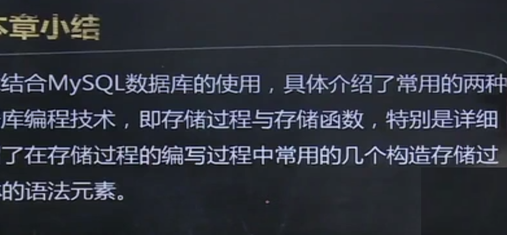

## 第六章 数据库安全与保护

### 第一节 数据库完整性

> 1. 完整性约束条件的作用对象
>    1. 列级约束 主要指**列的类型，取值范围，精度等约束 **
>    2. 元组约束 主要指**元组中各个字段之间的相互约束**，列如活动的开始日期小于结束日期
>    3. 表级约束 主要指**若干元组之间，关系之间的联系的约束**
> 2. 定义与现实完整性约束
>    1. 实体完整性 **保证记录不重复，其中至少有一列值不重复,用PRIMARY KEY添加约束**，如列级约束,表级约束。候选键使用关键字 **UNIQUE**进行约束，候选键与主键约束的区别
>       1. 一个表**只能存在一个主键**，但**可以存在多个候选键** 
>       2. **定义主键约束**时，系统会**自动产生PRIMARY KEY索引**，定义候选键时，系统会自动产生**UNIQUE(唯一)**索引
>    2. 参照完整性 指**两表之间的关系,保证数据的准确性**
>       - 语法格式 **REFERENCES tbl_name [(index_col_name,...)]**
>    3. 自定义完整性
>       1. 非空约束
>          - 可通过**CRETE TABLE或ALTER TABLE语句中**的某列定义后面，**加上关键字 “NOTNULL”作为限定词**
>       2. 自定义约束
>          - 语法格式 **CHECK(expr)**
> 3. 命名完整性约束
>    1. 为约束添加名称
>       - 语法格式 **CONSTRAINT [symbol]**
> 4. 更新完整性约束
>    1. 删除约束
>       1. ALTER  TABLE<表名> DROP FOREI  GN KEY <外键约束名>
>       2.  ALTER TABLE<表名> DROP PRIMARY KEY
>       3. ALTER TABLE<表名> DROP {约束名|候选键字段名}
>    2. 添加约束
>       1.  ALTER TABLE<表名> ADD [CONSTRAINT<约束名>] PRIMARY KEY(主键字段)
>       2. ALTER TABLE<表名> ADD [CONSTRAINT<约束名>] FROEIGN KEY(外键字段名) REFERNCES 被参照表(主键字段名)
>       3. ALTER TABLE<表名> ADD[CONSTRAINT <约束名>] UNIQUE KEY(主键字段)

### 第二节 触发器

> 1.  触发器是 **保护表数据的数据库对象**，当指定表发生 **INSERT(插入数据)，UPDATE(修改数据),DELETE(删除数据)**时触发，进行相应动作
> 2. 触发器的创建
>    - 语法格式一 **CREATE TRIGGER trigger name trigger_time tigger event ON tbl_name FOR EACH ROW trigger_body**
>    - 语法格式二 **CREATE TRIGGER 触发器名称 AFTER 触发的操作 ON 被操作的表FOR EACH ROW 触发后需完成的动作 **
> 3. 删除触发器
>    - 语法格式 **DROP TRIGGER [IF EXIST] [schema_name.]trigger_name**

### 第三节 安全性与访问控制

> 1. 用户账户管理
>
>    - 创建用户
>
>      - 语法格式 **CREATE USER user [IDENTIFIED BY [PASSWORD] 'password'] [,user [IDENTIFIED BY [PASSWORD]'password']]...**
>
>      - 说明：user的**格式为 ‘user_name’(用户名) @ ‘host name’(主机ip)**
>
>        |     参数      | 参数含义                                                     |
>        | :-----------: | ------------------------------------------------------------ |
>        | IDENTIFIED BY | 可为账户设置密码，特别是在纯文本中指定密码需忽略PASSWORD关键字 |
>        |   PASSWORD    | 不以明文发送密码而是指定PASSWORD()函数返回密码的混编值       |
>
>    - 查看用户信息
>
>      - 语法格式 **SELECT user,password from mysql.user**
>
>    - 删除用户
>
>      - 语法格式 **DROP USER user('用户名'@'主机ip') [,user_name]**
>      - 说明：DROP USER语句用于**删除一个或多个MySQL账户，并取消其权限(切记不要删除root)**，使用DROP YSER,**必须拥有mysql数据库的全局CREATE USER或DELETE权限**
>
>    - 修改用户账户 
>
>      - 语法格式 **RENAME USER old_user('用户名'@'主机ip') TO new_user('用户名 '@'主机ip'),[,old_user TO new_user]....**
>      - 说明 RENAME USER 语句是**对原有MySQL账户进行重命名**,要使用RENAME USER,**必须拥有全局CREATE USER 或 MySQL 数据库UPDATE权限**，如果**旧用户不存在或新用户已存在，则出现错误**
>
>    - 修改用户口令
>
>      - 语法格式 **SET PASSWORD [FOR user] = PASSWORD('newpassword')**
>      - 说明 如果**不加FOR user,表示修改当前用户密码,加了FOR user则修改当前主机上的特定用户密码**，user为用户名，**user的值必须为给定格式'user_nmae'@'host_name'的格式给定**
>
> 2. 用户权限管理
>
>    - 权限授予 **新的SQL用户不允许访问属于其他SQL用户的表**，也**不能立刻创建自己的表**，须得到授权。
>
>    - 授权权限类型
>
>      - 列权限 **和表中的一个具体列相关**
>      - 表权限 **和一个具体表中的所有数据相关** 
>      - 数据库权限 和一个**具体的数据库中的所有表相关**
>      - 用户权限 和**MySQL所有的数据库相关**
>
>    - 用户授权
>
>      - 给某**用户授权**使用 **GRANT**,使用**SHOW GRANT**语句**查看当前用户权限**
>
>      - 语法格式 **GRANT pri_type[(column_list)] [,priv_type [(column_list)]] ... ON [object_type] {tb;_name|*| * . * | db_name.*} TO user [IDENTIFIRD BY [PASSWORD]'PASSWORD'] [,user [IDENTIFIED BY[PASSWORD] 'password']].... [WITH with_option [with_option]...]**
>
>        |   参数    | 参数说明                                |
>        | :-------: | --------------------------------------- |
>        | priv_type | 权限名称，不同对象授权的priv_type值不同 |
>        |    TO     | 设置用户密码                            |
>        |    ON     | 授权的数据库或表名(可为视图称或表名)    |
>
>        | priv_type   参数(表权限和列权限2-11，数据库权限13-22，用户权限23-25) | 参数说明                                                     |
>        | :----------------------------------------------------------: | ------------------------------------------------------------ |
>        |                            SELECT                            | 给予用户使用SELECT语句访问特定表的权力，用户可以在视图公式中包含表，但需要拥有视图公式中的每张表的SELETE权限 |
>        |                            INSERT                            | 给予用户使用INSERT语句向特定表执行添加行的权力               |
>        |                            DELETE                            | 给予用户使用DELETE语句向特定表执行删除行权力                 |
>        |                            UPDATE                            | 给予用户使用UPDATE语句向特定表执行修改行权力                 |
>        |                          REFRENCES                           | 给予用户创建外键来参照特定的表的权利                         |
>        |                            CAEATE                            | 给予用户使用特定的名称创建的权力                             |
>        |                            ALTER                             | 给予用户使用ALTER TABLE语句修改表的权力                      |
>        |                            INDEX                             | 给予用户在表上定义索引的权力                                 |
>        |                             DROP                             | 给予用户删除表的权力                                         |
>        |                     ALL或ALL PRIVILEGES                      | 表示所有权限名                                               |
>        |                                                              |                                                              |
>        |                            SELETE                            | 给予用户使用SELETE语句访问特定数据库中所有表和视图的权力     |
>        |                            INSERT                            | 给予用户使用INSERT语句向特定数据库中所有表添加行的权力       |
>        |                            DELETE                            | 给予用户使用DELETE语句向特定数据库中所有表删除行的权力       |
>        |                            UPDATE                            | 给予用户使用UPDATE语句向特定数据库中所有表修改行的权力       |
>        |                          REFERENCES                          | 给予用户创建指向特定数据库中的表外键的权力                   |
>        |                        CREATE ROUTINE                        | 给予用户为特定数据库创建存储过程和存储函数等权力             |
>        |                        ALTER ROUTINE                         | 给予用户更新和删除数据库中已有的存储过程和存储函数等权力     |
>        |                       EXECUTE ROUTINE                        | 给予用户弔用特定数据库的存储过程和存储函数的权力             |
>        |                         LOCK TABLES                          | 给予用户锁定特定数据库表的权力                               |
>        |                     ALL或ALL PRIVILEGES                      | 表示以上所有权限名(12-20)                                    |
>        |                                                              |                                                              |
>        |                         CREATE USER                          | 给予用户创建和删除新用户的权力                               |
>        |                        SHOW DATABASES                        | 给予用户使用SHOW的权力                                       |
>        |                                                              |                                                              |
>
>        - 注意 
>          -  授权列权限时，赋予SELECT，INSERT和UPDATE的同时**需加上列名列表column_list，不加则授权全表** 
>          - 授权表权限时，**ON关键字后面跟tbl_name,tbl_name为表名或视图名**
>          - 授权数据库权限，**表权限适用于一个特定的表，MySQL支持针对整个数据库权限**
>          - 授权用户权限 ，**最高效的权限**。对于**需要授权数据库权限的所有语句，也可以定义在用户权限上**
>          - 在GRANT语句格式中，**数据库授权**时ON子句后跟‘ * ’ 和‘db_name.* ’。**'*'表示当前数据库的所有表；'db_name. * '表示某个数据库中的所有表**，**授权用户权限**时ON子句中**使用‘* . *’,表示所有数据库的所有表**
>          - 在DATABASES语句查看所有已有数据库的定义和权力。
>
>    - 权限转移与限制
>
>      - GRANT语句的**最后可使用WITH语句**。如果**指定为WITH GRANT OPTION,**则表示**TO子句中指定的所有用户**都有把**自己拥有的权限授权给其他用户的权力**，而**不管**其他用户**是否拥有此权限**
>
>        |        WITH 参数         | 参数含义                                                   |
>        | :----------------------: | ---------------------------------------------------------- |
>        |   MAX_QUERIES_PER_HOUR   | count表示每小时查询数据库的 参数                           |
>        | MAX_CONNECTIONS_PER_HOUR | count表示每小时可连接数据库的次数                          |
>        |   MAX_UPDATES_PER_HOUR   | count表示每小时可修改数据库的次数                          |
>        |   MAX_USER_CONNECTIONS   | count表示同时连接MySQL的最大用户数                         |
>        |          count           | 是一个数值，对于前三个而言，count如果为0则表示不起限制作用 |
>
>    - 权限撤销
>
>      - 语法格式一(回收特定权限) **REVOKE priv_type [(column_list)] [,priv_type[(column_list)]]... ON{tbl_name| * ｜ * . * | db_name.*} FROM user[,user]...**
>      - 语法二(所有权限回收) **REVOKE ALL PRIVILEGES,GRANT OPTION FROM user[,user]...**
>      - 在**使用REVOKE时,**用户**须拥有MySQL数据库的 全局CREATE USER或UPDATE权限**

### 第四节 事务与并发控制  

> 1. 事务概念 
>    - 事务是**用户定义的数据库操作序列**,这些操作**要么全做，要么不做,是不可分割的工作单位,事务和程序是两个概念**,在关系数据库中，事务可以是**一条SQL语句，一组SQL语句或整个程序**,一个程序**通常包含多个事务**,事务是**恢复和并发控制的基本单位**
>    - 事务的ACID特性
>      - 原子性(Atomicity) 一组更新操作是**原子不可分的**
>      - 一致性(Consistency) 事务**必须满足数据库的完整性约束**，数据库由一个**一致性状态转变到另一个一致性状态**
>      - 隔离性(Isolation)  要去**事务是彼此对立的，隔离的**
>      - 持续性(Durability) 也称永久性(Permanence),指一个**事务一旦提交**，对数据库中**数据的改变就应该是永久性**
>    - 并发操作问题
>      1. 丢失更新
>         - 设有两个事务T1与T2,当他们**同时读入同一数值修改时**，**事务T2会破坏T1的事务提交**，导致**事务T1修改丢失**
>      2. 不可重复读
>         - 设有两个事物T1和T2，不可重复读是**指事务T1读取数据后，事务T2执行更新操作**，导致**事务T1无法再现前一次的读取结果**
>      3. 读脏数据
>         - 设有两个事务T1和T2，读“脏”数据指的是事务**T1修改某一数据后，写入磁盘，事务T2读取同一数据后，事务T1**由于其他原因**撤销之前的操作**，使**数据恢复原状**，导致**数据库内数据与事务T2所持数据不一致**， 则**事务T2数据为“脏”数据**，即不正确数据
>    - 封锁
>      1. 琐的基本思想：事务向**系统请求对所需数据进行加琐**，以**确保不被非预期改变**
>      2. 琐 实质上是**允许或阻止**一个事**务对数据对象的存取特权**,基本封锁类型分为 **排他锁(Exclusive Lock,X琐)**和**共享锁(Shared Lock,S琐)**
>      3. 用封锁进行并发控制
>         1. 若**事务T对数据D加X琐**,则所有别的**事务对数据D的琐请求**都**必须等待事务T释放琐**
>         2. 若**事务T对数据D加S琐**，则别的**事务还可以对数据D请求S琐**，而**对数据D的X琐请求必须等待直到事务T释放琐**
>         3. 事务**执行数据库操作**时需**先请求相应的琐**,即对**读请求S琐**，对**更新(插入，删除，修改)请求X琐**，过程一般由**DBMS执行操作**时**自动隐含地进行**
>         4. 事务一**直占有获得的琐直到结束(COMMIT或ROLLBACK)时释放**
>    - 封锁的粒度
>      - 通常以粒度来**描述封锁的数据单元大小**，**DBMS**可以**决定不同粒度的琐**。由**最底层数据元素到最高层的整个数据库,粒度越细，并发性越大**，但**软件复杂性和系统开销也就越大**
>    - 封锁的级别
>      1. 0级封琐
>         - 封锁的事务**不重写其他非0级封锁事务的未提交更新的数据**。这种状态**实际上实用价值不大**
>      2. 1级封锁
>         - 被封锁的事务**不允许重写未提交的更新数**据，这**防止**了**丢失更新的发生**
>      3. 2级封锁
>         - 被封锁的事务**既不重写也不读取未提交的更新数据**.**防止**了**丢失更新和读脏数据发生**
>      4. 3级封锁
>         - 被封锁的事务**不读未提交的更新数据且不写任何(包括读操作)未提交数据**
>    - 死锁和活锁
>      - 封锁可能会出现'活锁'与'死锁'问题
>      - 活锁
>        - 指的是**级别低的事务无法执行**
>        - **避免方法 采用先来先服务的策略。**
>        - 当多个**事务请求封锁同一数据对象**时,按请求封锁**的先后次序进行事务排队**，该数据对象的**琐一旦释放**，**首先批准**申请**队列中的第一个事务获取琐**
>      - 死锁
>        - 指的是 **两个以上事务循环等待被同组中另一个事务锁住的数据单元的情形**
>        - 避免方法
>          1. 一次性琐请求
>          2. 琐请求排序
>          3. 序列化处理
>          4. 资源剥夺
>          5. 不防止，让其发生并随时进行检测，一旦系统发现死锁则进行解除处理
>    - 可串行行
>      - 一组事务的一个**调度是他们基本操作的一种排序**，通常，在数据库系统中，**可串行性是并发执行的正确性准则**，即当**事务的并发执行调度可串行化的，才为正确的** 
>    - 两段封锁法
>      - 事务划分如下两个阶段
>        1. 发展(Growing)或加琐阶段
>           - 在此期间，对任一数据对象进行任何操作之前，事务都需获取该对象的一个相应的琐
>        2. 收缩(Shrinking)或释放锁
>           - 一旦事务释放琐，则表明它已进入此阶段，无需请求任何另外的琐
>      - 定理 **遵循两段琐协议的事务的任何并发调度都是可串行化的**

### 第五节 备份与恢复

> 1. 备份与恢复
>    - 数据库数据丢失或被破坏可能由以下原因
>      1. 计算机硬件故障
>         - 由于使用的不当或质量问题，导致硬件故障，从而导致丢失数据
>      2. 软件故障
>         - 由于软件设计上的失误或用户使用不当，导致软件系统出现误操作从而导致数据被破坏
>      3. 病毒
>         - 破坏性病毒破坏软件系统，硬件和数据
>      4. 误操作
>         - 用户使用数据库增删改语句不当而引发的数据丢失或破坏
>      5. 自然灾害
>         - 由于自然灾害的原因，导致计算机系统及数据被破坏
>      6. 盗窃
>         - 部分重要数据被盗窃
> 2. 使用SELECT INTO...OUTFILE语句备份数据
>    - 可**使用SELETE INTO....OUTFILE语句将表数据导入文本文件**中，并**使用LOAD DATA ... INFILE语句恢复数据**，但该方法**只能导出或导入数据内容，不包括表结构**，如果**表结构**文件**损坏需先恢复原来的表结构**
>    
>    - 语法格式 SELECT * INTO OUTFILE 'file_name' export_options | DUMPFILE 'file_name'
>    
>    - 说明
>      
>      - export_options格式为 [FIELDS [TERMINATED BY 'string'] [[OPTIONALLY] ENCLOSED BY 'char'] [ESCAPED BY 'char']] [LINES TERMINATED BY 'string']
>      - 作用是将表中SELECT语句选中的行写入文件，**file_name是文件名称**，文件**默认在服务器主机上创建**，并且**文件名不能是已存在的**，**不然会覆盖文件**之前的内容，如果需**写到特定的位置**，则需在**文件名前加上具体路径**，在文件中，**数据以一定的形式存放，“\N”表空值**
>      - 使用OUTFILE时，可在export_options中加入两种自选子句，作用是决定数据行在文件中存放的格式
>        - FIELDS子句：在FIELDS子句中有三个亚子句,	如果使用FIELDS子句则至少指定其中一个亚子句
>          - TERMINATED BY 用于**指定字段值之间的符号**
>          - [OPTIONALLY] ENCLOSED BY 用于**指定包裹文件中字符值的符号**
>          - ESCAPED BY 用于**指定转义字符**
>        - LINES子句：在LINES子句中使用TREMINATED BY指定一行结束的标志
>          - 如果FIELDS和LINES子句都不指定,则默认声明:
>            - 
>          - 如果使用DUMPFILE而不是使用OUTFILE，导出的文件里的行底啥彼此紧挨着的,值和行之间没有任何标记 
>      
>    - 使用LOAD DATA...INFILE语句恢复数据
>    
>      - 语法格式 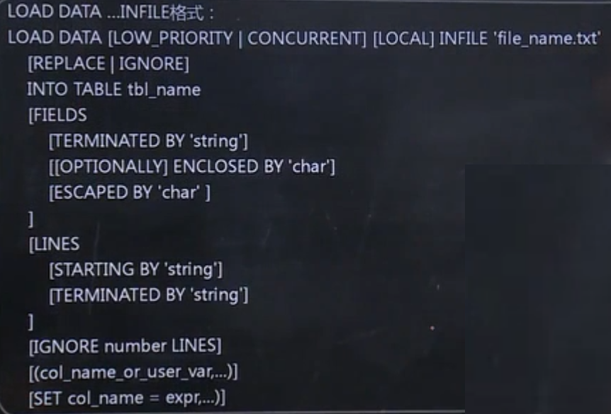
>    
>        | 参数                       | 参数含义                                                     |
>        | -------------------------- | ------------------------------------------------------------ |
>        | LOW_PRIORITY \| CONCURRENT | 若指定LOW_PRIOPITY，则延迟语句的执行，若执行CONCURRENT，则当LOAD DATA 正在执行时，其他线程也可以同时使用该表数据 |
>        | LOCAL                      | 若指定LOCAL，则文件会被客户主机上的客户端读取，并发送至服务器，文件会被给予完整的路径名称，以指定确切的位置 |
>        | tb_name                    | 需要导入数据的表名，该表在数据库中必须存在，表结构必须与导入文件的数据行一致 |
>        | PEPLACE \| IGNORE          | 如果指定了REPLACE，则文件中出现与原有行相同的唯一关键字值时，输入行会替换原有行，如果指定了IGNORE，则与原有行相同的唯一关键字值的输入行跳过 |
>        | IGNORE number LINES        | 选项可忽略文件的前几行(number为跳过的行数)                   |
>        | col_name_or_user_var       | 如需载入一个表的部分列或文件中字段值顺序与表中列的顺序不同，就须指定列清单，其中包含列名或用户变量 |

### 本章小结

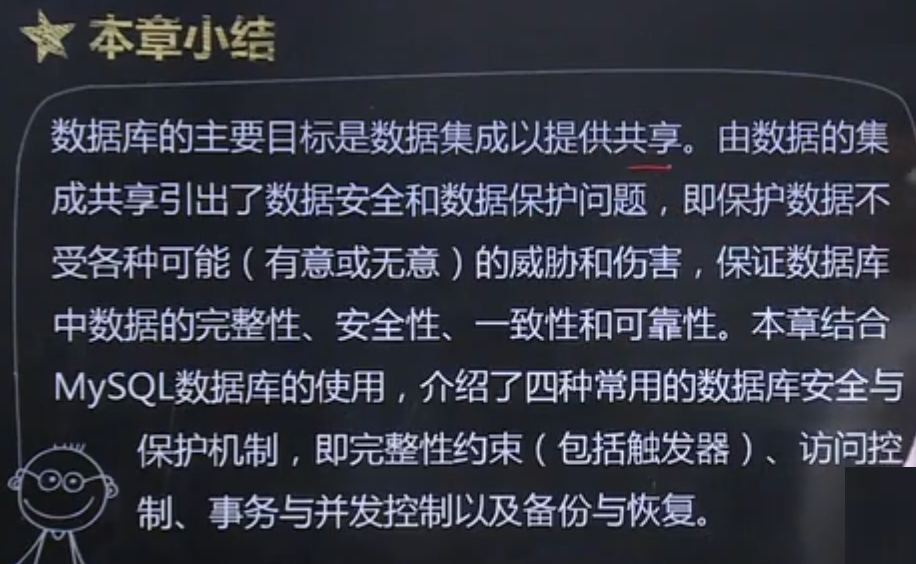

## 第七章 数据库应用设计与开发实例 

> #### **由于是实例篇所以笔记可能会参差不齐**

### 第一章 需求描述

> - 非功能需求
>
>   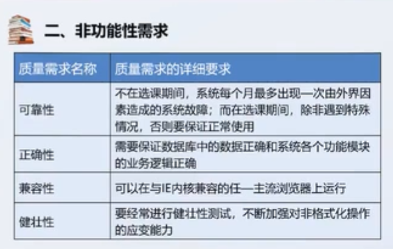

### 第二章 系统设计

> 1. 功能模块设计
> 2. 数据库设计
>    - 确定实体
>    - 局部信息结构
>    - 全局信息结构
>    -  逻辑设计与规范设计

### 第三章 系统实现

> 实操就没写了

### 第四章 系统测试与维护

> 1. 系统测试与维护
>    - 

### 本章小结

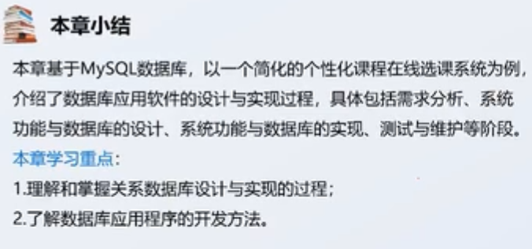

## 第八章 数据库管理技术的发展

### 第一节 数据库技术发展概述

> 1.  第一代数据库系统
>    1. IMS 层次模型 IBM 1969
>    2. CODASYL 网状模型 DBTG 1970
>    3. 特点
>       1. 支持三级模型
>       2. 用存储路径表示联系
>       3. 独立的DDL
>       4. 导航的DML
> 2.  第二代数据库系统(关系数据库模型)
>    1. E.F.Codd，1970 关系代数的提出
>    2. 系统原型
>       1. IBM System R
>       2. Berkeley INGRES
>    3. 1980s后，新开发的系统都是关系型的
> 3. 新一代数据库系统
>    1. OODB 没有被市场普遍接受
>    2. ORDB 新一代将是多种模型并存
>    3. 第三代的基本特征
>       1. 支持数据管理，对象管理和知识原理
>       2. 保持或继承RDB技术
>       3. 开放性
> 4. 应用 数据仓库，工程数据库。统计数据库，空间数据库，科学数据库等多种 数据库

### 第二节 数据仓库与数据挖掘

> 1.  从数据库到数据仓库
>
>    
>
> 2. 数据仓库的只要特征
>
>    1. 面向主题
>    2. 集成性
>    3. 数据的非易失性
>    4. 数据的时变性
>
> 3. 数据仓库的三大概念
>
>    1. 粒度 指数据库的数据单元中保存数据的细化或综合程度的级别
>    2. 分割 指数据分散到各自的物理单元中，以便能分别处理，以提高数据处理的效率
>    3. 维   指人们观察数据的特定角度是考虑问题时的一类属性
>
> 4. 数据挖掘(Data Mining)是**大量的，不完全的，有噪音的，模糊的，随机的实际**应用**数据**中**发现并提取**的**不为人知**但**又潜在有用的信息和知识**的一种技术，也被称为**数据库中的知识发现(Knowledge Discovery in DataBase，KDD)**，其与**数据库，数理统计，机器学习，模式识别，模糊数字等诸多技术相关**
>
> 5. 数据挖掘具备六大功能
>
>    1. 概念描述
>    2. 关联分析
>    3. 分类与预测
>    4. 聚类
>    5. 孤立点检测
>    6. 趋势和演变分析

### 第三节 大数据管理技术

> 1.  大数据定义
>
>    1. 数据尚无统一定义，通常认定为数据量，大数据形式多样化的数据
>
>    2. 大数据的特征
>
>       1. 数据量大 即大量化(Volume)
>       2. 处理速度快 即快速化(Velocity)
>       3. 数据种类繁多 即多样化(Variety)
>       4. 价值(Value) 密度低
>    
> 2. 大数据存储
>
>    1. NoSQL数据管理系统
>
>       | 类型                |                           类型含义                           |
>       | ------------------- | :----------------------------------------------------------: |
>       | 键值(Key-Value)存储 | 常见的键值存储数据库，包括Tokyo Cabinet/Tyrant，Redis和Oracle BDB等 |
>       | 文档存储            |            常见的文档型数据库有CouchDB，MongoDB等            |
>       | 列存储              |                  常见的列存储数据库有Hbase                   |
>       | 图存储              |     图存数据库是基于图理论构建的使用节点，属性和边的概念     |
>
> 3. MapReduce技术
>
>    - MapReduce是一种并行编程模型，把计算过程分解为两个阶段，即Map和Reduce阶段

### 本章小结

