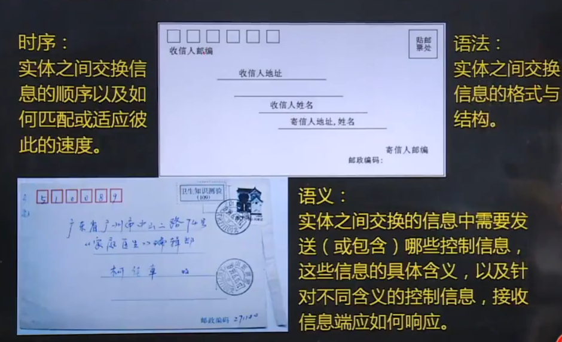

# 计算机网络原理

## 一，计算机网络基本概念

### 1.计算机网络定义

### 2.协定的定义

### 3.计算机网络功能

> 1. 硬件资源共享
> 2. 软件资源共享
> 3. 信息资源共享

### 4. 计算机网络的分类

> 1. 按**覆盖范围**：个域网，局域网，城域网，广域网
> 2. 按**拓扑结构**：星形，总线型，环形，网型，树形，混合拓扑结构等
> 3. 按**交换方式**：电路交换网络，报文交换网络和分组交换网络
> 4. 按**网络用户属性**：公用网，私有网

## 二，计算机网络结构

> 1. 网络边缘
>
> 2. 接入网络
>
>    - 电话拨号
>    - 非对称用户数字线**ADSL**
>    - 混合光纤同轴电缆**HFC**
>    - 局域网
>    - 移动接入网络
>
> 3. 网络核心
>
>    

## 三，数据交换技术

### 1.数据集合概念

> **交换节点和传输介质的集合称之为通信子网,即网络核心**

### 2.电机交换

> 在电路交还网络中，首先需要**通过中间的交换节点为两台主机创建一条专用的通信线路**,称之为**电路**，然后再**利用该电路进行通信**，通信结束后再**拆除电路**

> 电路交换的优点是**实时性高，时延和时延抖动都较小**,缺点是对于**突发性数据传输，信道利用率低且传输速度单一**

### 3.报文交换

> **以报文为单位**在交换网络的各个节点间以**存储-转发**的方式进行传递

> 1. **不需要建立连接**
> 2. **只有当报文被转发时才占用相应的信道**
> 3. **交换节点需要缓冲存储，报文需要排队，增加延时**

### 4.分组交换

> 分组交换将一个完整报文拆分为若干**分组**，分组传输过程通常也采用**存储-转发**交换方式

> 优点
>
> - 交换设备存储容量要求低
> - 交换速度快
> - 可靠传输效率高
> - 更加公平
>
> 分组长度的确定
>
> - 分组长度与延迟时间
> - 分组长度用于误码率

## 四，计算机网络性能

### 1.速率与带宽

> 1. **速率**是指网络单位时间内传送的数据量，也称之为**数据传输速率或数据速率**，速率单位是**bit/s(位每秒)**
> 2. 在计算机网络中，有时使用**带宽**来描述速率
> 3. **带宽**原来是指信号具有的**频带宽度**，即**信号成分的最高频率与最低频率之差**，单位为**Hz(赫兹)**

### 2.时延

> 1. **时延**是指**数据从网络中的一个节点(主机或交换设备)到达另一个节点所需要的时间**
> 2. 分组的每跳传输过程主要产生**四类时间延迟**:**节点处理时延，排队时延，传输时延和传播时延**

### 3.时延带宽积

> 一段**物理链路的传播时延与链路带宽的乘积**，表示一段链路可以容纳的数据位数，也称之为以位为单位的链路长度，

