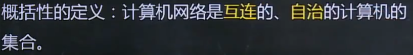

# 计算机网络原理

## 一，计算机网络基本概念

### 1.计算机网络定义

### 2.协定的定义

### 3.计算机网络功能

> 1. 硬件资源共享
> 2. 软件资源共享
> 3. 信息资源共享

### 4. 计算机网络的分类

> 1. 按**覆盖范围**：个域网，局域网，城域网，广域网
> 2. 按**拓扑结构**：星形，总线型，环形，网型，树形，混合拓扑结构等
> 3. 按**交换方式**：电路交换网络，报文交换网络和分组交换网络
> 4. 按**网络用户属性**：公用网，私有网

## 二，计算机网络结构

> 1. 网络边缘
>
> 2. 接入网络
>
>    - 电话拨号
>    - 非对称用户数字线**ADSL**
>    - 混合光纤同轴电缆**HFC**
>    - 局域网
>    - 移动接入网络
>
> 3. 网络核心
>
>    

## 三，数据交还技术

### 1.数据集合概念

> **交换节点和传输介质的集合称之为通信子网,即网络核心**

### 2.电机交换

> 在电路交还网络中，首先需要**通过中间的交换节点为两台主机创建一条专用的通信线路**,称之为**电路**，然后再**利用该电路进行通信**，通信结束后再**拆除电路**

> 电路交换的优点是**实时性高，时延和时延抖动都较小**,缺点是对于**突发性数据传输，信道利用率低且传输速度单一**

### 3.报文交换